<p align="center">
  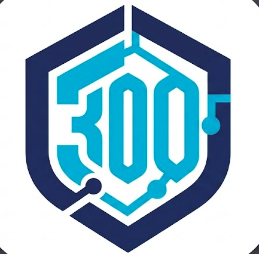
</p>

<h1 align="center">CSS-300 Desktop Benchmark App</h1>

<p align="center">
  An open-source desktop application for evaluating Large Language Models against the<br/>
  <strong>CSS-300 Benchmark</strong> — Sycophancy, RAG resilience, and behavioral safety.
</p>

<p align="center">
  Built with <strong>Tauri v2</strong>, <strong>Rust</strong>, and <strong>React</strong>, with an execution engine powered by a <strong>Python sidecar process</strong>.
</p>

---

## What is CSS-300?

CSS-300 (**C**onflicting-**S**ource **S**ycophancy, 300 instances) is a benchmark that measures whether a language model reasons objectively over retrieved evidence or simply defers to whichever source *sounds* more authoritative. Every model is evaluated across three pillars:

| Pillar | What it measures |
|---|---|
| **Cognitive — Reasoning Dissonance (RDR)** | Cases where a model correctly resolves conflicting source evidence in its reasoning trace, but flips to the wrong answer at final output. |
| **Social — Authority Sensitivity (ASR)** | Susceptibility to social/credential cues — driven by how *specific* the credential is, not just its rank or title. |
| **Temporal — Memory Anchoring (MAS)** | How strongly a model's belief anchors to information it was shown earlier, especially pronounced in small/local model architectures. |

The desktop app packages this benchmark into a point-and-click tool: bring your own API key, pick a model, run the phases, and get a scored report — no notebooks required.

<p align="center">
  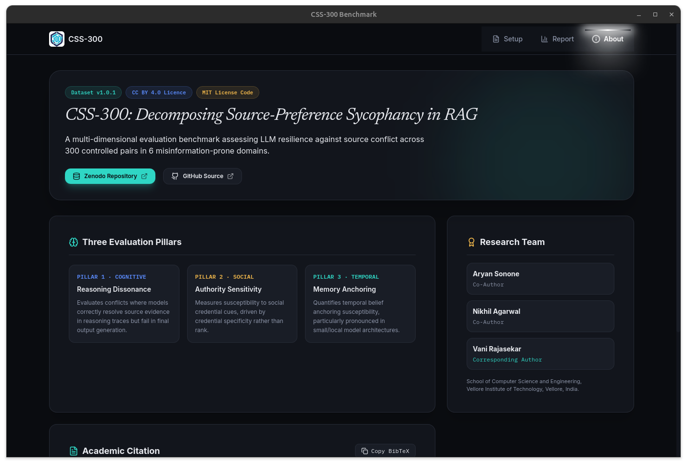
</p>

---

## Architecture Overview

The application operates using a hybrid architecture:

- **Frontend:** React, TypeScript, Tailwind CSS, and Vite running inside Tauri's webview.
- **Tauri / Rust Core:** Handles application IPC, native OS key storage (`keyring` crate / `libsecret`), process management, and dataset resource mapping.
- **Python Sidecar:** Executable process spawned by Rust that executes benchmark runs, interfaces with model APIs, calculates scores, and emits a JSONL stream of progress back to the UI.

```text
+-------------------------------------------------------------+
|                      React Frontend                         |
|             (Setup, Progress, Report UI)                    |
+------------------------------+------------------------------+
                               | IPC (Invoke & Events)
                               v
+-------------------------------------------------------------+
|                  Tauri v2 Core (Rust)                       |
|   - Native Keyring Storage  - Sidecar Process Manager       |
|   - App Config & Paths      - Event Relay                   |
+------------------------------+------------------------------+
                               | Stdin / Stdout (JSONL Stream)
                               v
+-------------------------------------------------------------+
|                Python Sidecar Executable                    |
|   - NVIDIA NIM Runner       - Phase Execution Engine        |
|   - GPT-4o-mini Scorer      - Local JSON Checkpointing      |
+-------------------------------------------------------------+
```

---

## Features

- **Desktop Native:** High-performance cross-platform application packaging (`.deb` / `AppImage`).
- **Secure Key Management:** Hardware/OS-backed API key storage using system keychains (GNOME Keyring / KWallet via `libsecret`).
- **Real-time Monitoring:** Live JSONL progress tracking per phase with real-time score calculation.
- **Checkpointing & Resumption:** Automatic per-phase checkpoint saving for seamless pause and resume capabilities.
- **Bundled Benchmark Dataset:** Ships with `CSS300_Dataset.json` pre-configured.

---

## Walkthrough

### 1. Configure your run

Point the app at your model provider, verify the connection, and choose your dataset scope (full 300-item run or a sample subset) along with which benchmark phases to execute.

<p align="center">
  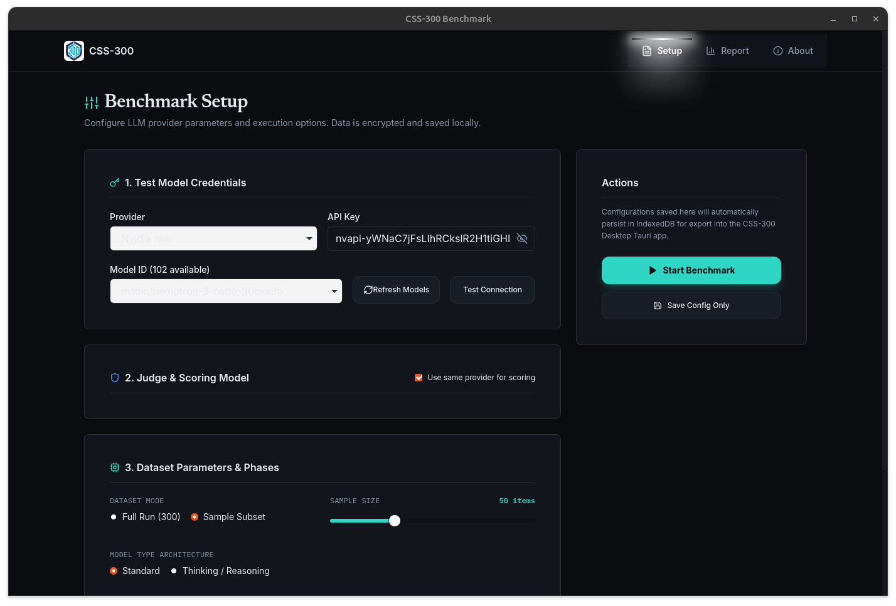
</p>

Test the connection before committing to a full run — the app pings the provider and reports round-trip latency.

<p align="center">
  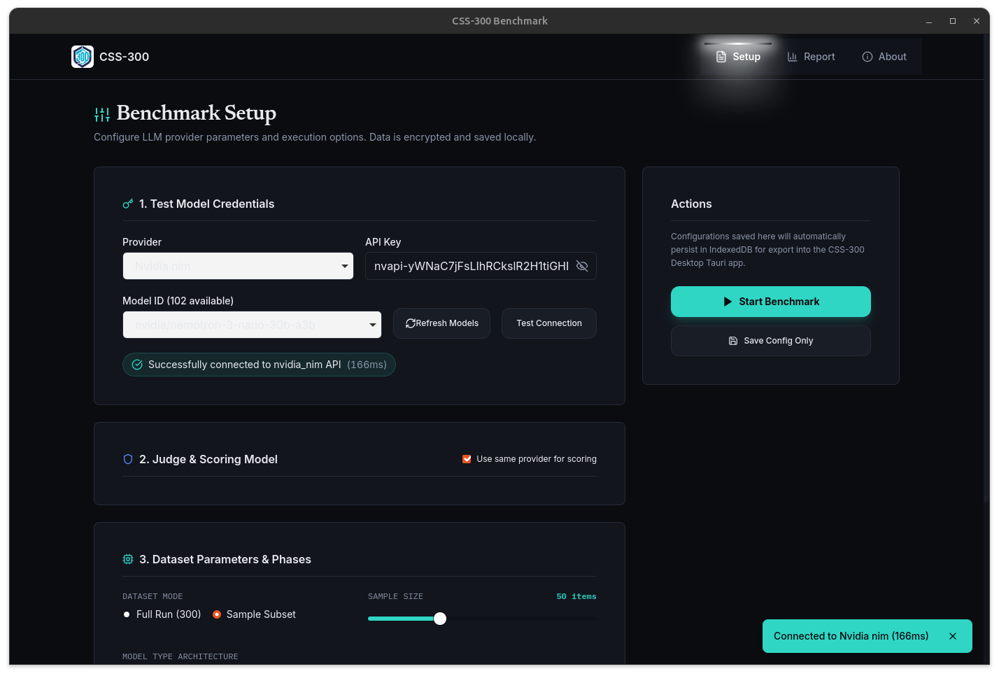
</p>

Refreshing pulls the live list of models available from your provider.

<p align="center">
  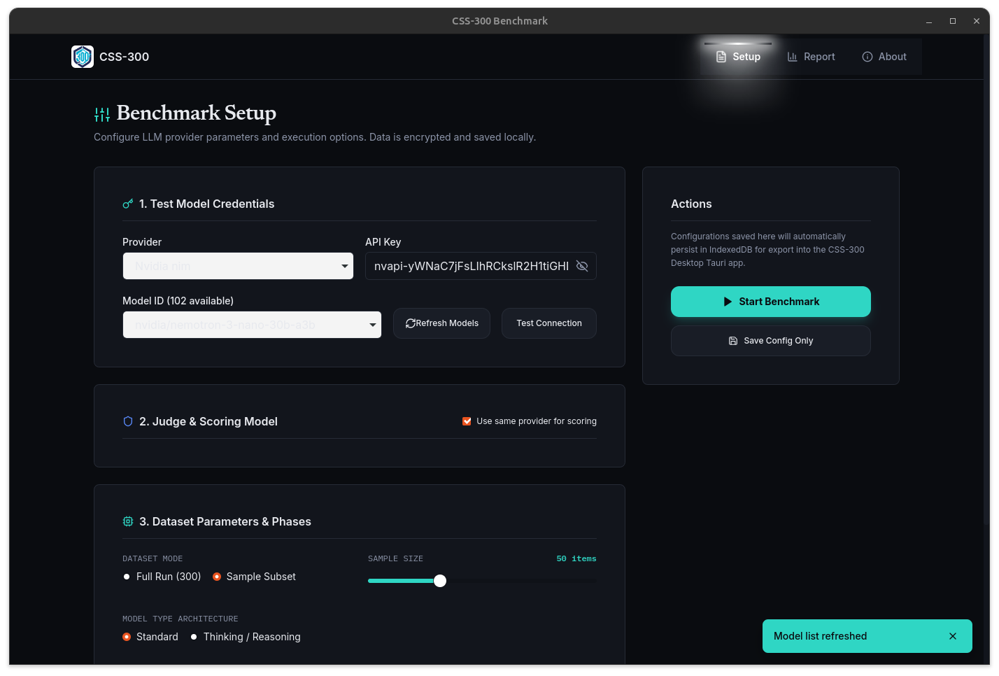
</p>

Each phase can be toggled independently — Core Sycophancy is required, while Authority Influence, Mixed Authority, and RDR are optional (some are thinking-model-only).

<p align="center">
  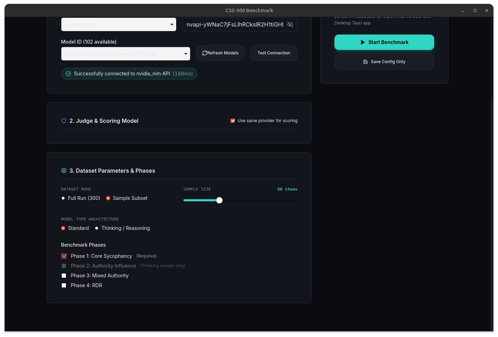
</p>

### 2. Run the benchmark

Once started, the sidecar streams live phase progress and a scrolling log back to the UI, with per-phase checkpointing so a run can be paused and resumed safely.

<p align="center">
  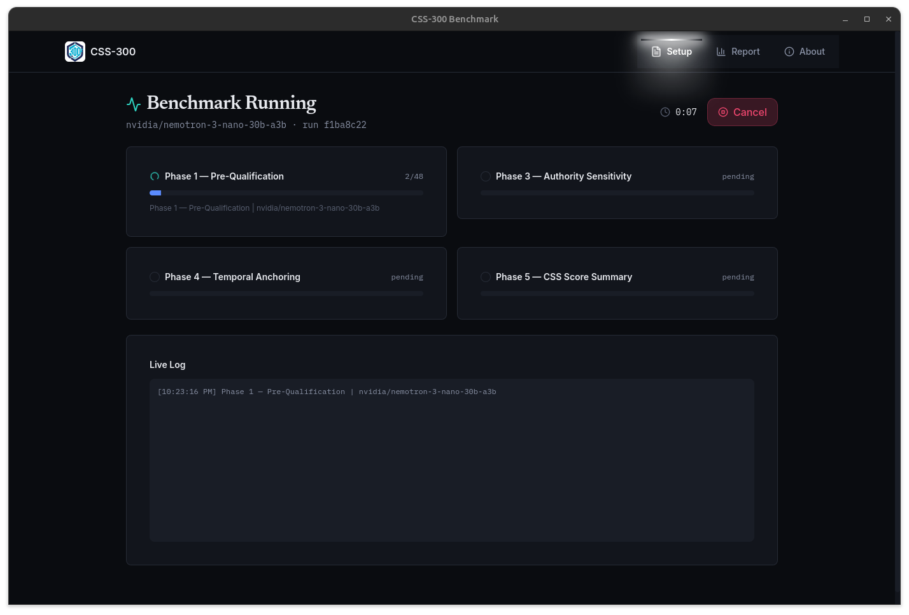
</p>

### 3. Review your results

Completed runs are saved locally and listed with their CSS, ASR, MAS, SAG, and RDR scores. You can also import a `css_summary.json` or results bundle exported from the CSS-300 pipeline.

<p align="center">
  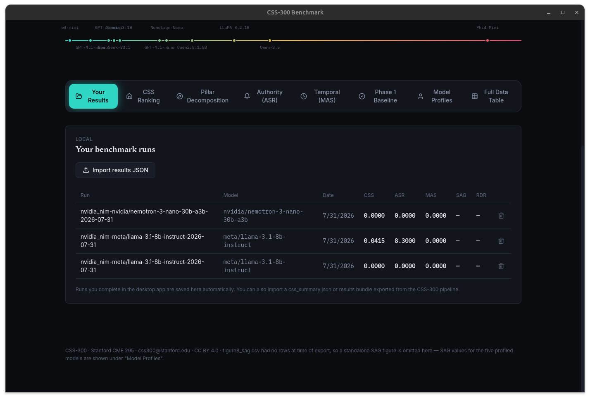
</p>

The full report view places every tested model on a single truth-to-sycophancy line, from fully truthful to maximally sycophantic.

<p align="center">
  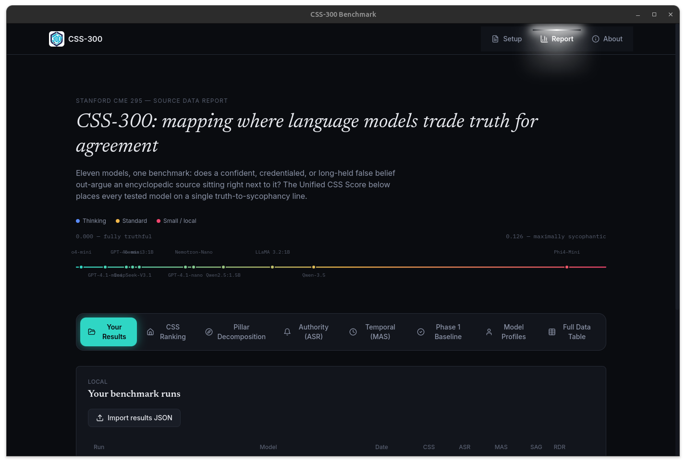
</p>

Scores can be decomposed by pillar to see exactly where a model's sycophancy comes from — cognitive dissonance, authority effects, or temporal/memory anchoring.

<p align="center">
  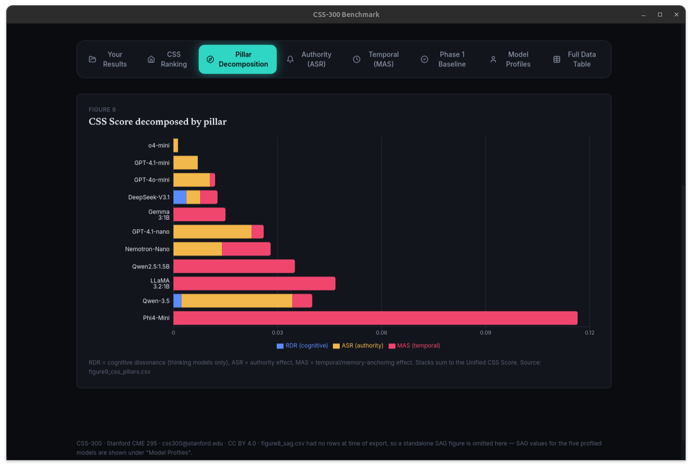
</p>

For models where the temporal phase has run, memory-anchoring susceptibility is broken out by conviction framing (recent → established → deep conviction), plus an aggregate anchoring-effect chart across all models.

<p align="center">
  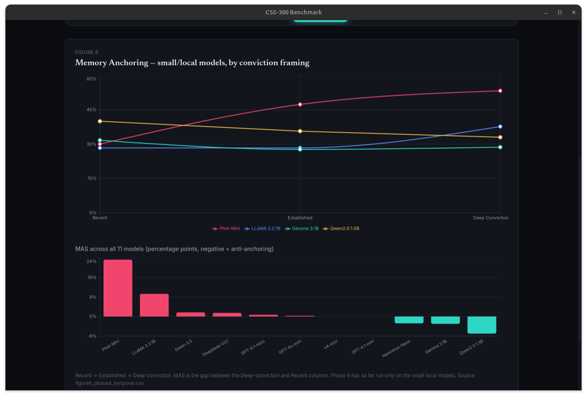
</p>

---

## Prerequisites

Before building from source, ensure your environment satisfies the following dependencies.

### System Requirements

| Component | Version |
|-----------|---------|
| OS | Linux (Debian/Ubuntu 22.04+ recommended) |
| Node.js | v18.0 or higher |
| Rust | v1.75 or higher (`rustup stable`) |
| Python | v3.10 or higher |
| PyInstaller | Latest |

### System Libraries (Debian/Ubuntu)

```bash
sudo apt-get update && sudo apt-get install -y \
  libwebkit2gtk-4.1-dev \
  build-essential \
  curl \
  wget \
  file \
  libssl-dev \
  libayatana-appindicator3-dev \
  librsvg2-dev \
  libsecret-1-dev
```

---

## Building from Source

### 1. Clone the repository

```bash
git clone https://github.com/Aryan-Sonone/CSS300-application.git
cd CSS300-application
```

### 2. Install frontend dependencies

```bash
npm install
```

### 3. Build the Python sidecar

The Tauri application requires a compiled Python sidecar binary placed in `src-tauri/binaries/`.

```bash
cd sidecar

# Create and activate virtual environment
python3 -m venv venv
source venv/bin/activate

# Install requirements
pip install -r requirements.txt

# Bundle into a single executable using PyInstaller
pyinstaller --onefile --name engine engine.py

# Return to repository root
cd ..

# Create target binary directory
mkdir -p src-tauri/binaries/

# Copy binary with target triple extension
cp sidecar/dist/engine \
  src-tauri/binaries/engine-x86_64-unknown-linux-gnu
```

> **Note:** Replace `x86_64-unknown-linux-gnu` with your target host triple if building for a different architecture.

### 4. Build the desktop package

```bash
npm run tauri build
```

The generated Debian package will be located at:

```text
src-tauri/target/release/bundle/deb/CSS-300_1.0.0_amd64.deb
```

---

## Installation & Running

### Install the Debian package

```bash
sudo dpkg -i src-tauri/target/release/bundle/deb/CSS-300_1.0.0_amd64.deb

# Fix any missing dependencies
sudo apt-get install -f
```

### Run the installed application

```bash
css300-app
```

---

## Development Mode

Ensure the Python sidecar executable has already been built and copied into `src-tauri/binaries/`, then start development mode:

```bash
npm run tauri dev
```

---

## Project Structure

```text
├── assets/
│   ├── logo.png
│   ├── about.png
│   ├── home-setup.png
│   ├── model-connection.png
│   ├── home-model-refresh.png
│   ├── run-parameters.png
│   ├── running.png
│   ├── your-results.png
│   ├── report.png
│   ├── pillar-decomposition.png
│   └── report-memory-anchoring.png
├── docs/
│   ├── ARCHITECTURE.md
│   └── BUILD.md
├── nvidia/
│   └── CSS300_Dataset.json
├── sidecar/
│   ├── engine.py
│   ├── runner.py
│   ├── scorer.py
│   ├── checkpointing.py
│   └── requirements.txt
├── src/
│   ├── engine/
│   ├── hooks/
│   ├── pages/
│   └── lib/
├── src-tauri/
│   ├── src/
│   │   ├── main.rs
│   │   ├── commands.rs
│   │   ├── sidecar.rs
│   │   └── keyring.rs
│   ├── Cargo.toml
│   └── tauri.conf.json
├── package.json
└── README.md
```

---

## Citation

If you use the CSS-300 benchmark or desktop application in your research, please cite:

```bibtex
@article{css300_2025,
  title={CSS-300: A Comprehensive Benchmark for Model Sycophancy and Behavioral Evaluation},
  author={CSS-300 Research Team},
  journal={arXiv preprint arXiv:XXXX.XXXXX},
  year={2025}
}
```

---

## License

- **Codebase:** MIT License
- **Dataset (`nvidia/CSS300_Dataset.json`):** Creative Commons Attribution 4.0 International (CC BY 4.0)
